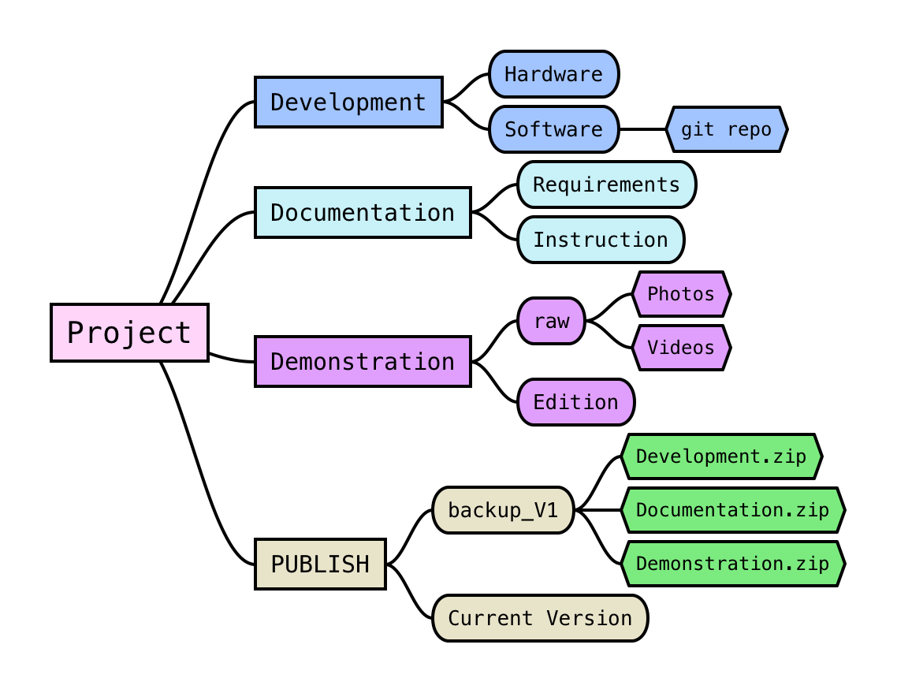

# Heliner Project Structure


<div style="display: flex;">
  <div style="flex: 4%;">
   <!-- CODE -->
  <pre><code>

Project
    ├── Demonstration
    │   ├── Edition
    │   └── raw
    │   
    ├── Development
    │   ├── Hardware
    │   └── Software
    │       └── GIT REPO 
    │   
    │   
    ├── Documentation
    │   ├── Instruction
    │   └── Requirements
    │   
    └── PUBLISH
        ├── Current Version
        └── backup_V1
  </code></pre>

  </div>
  <div style="flex:50%;">
   <!-- GRAPH -->
   
  </div>


</div>

# How To Generate the Project Folder
1. Terminal: (bash)

```
chmod +x HL_ProjectStructure.sh 
HL_ProjectStructure.sh
```

2. Terminal: (Python)
```
python HL_ProjectStructure.py
```

3. Copy the Folder

